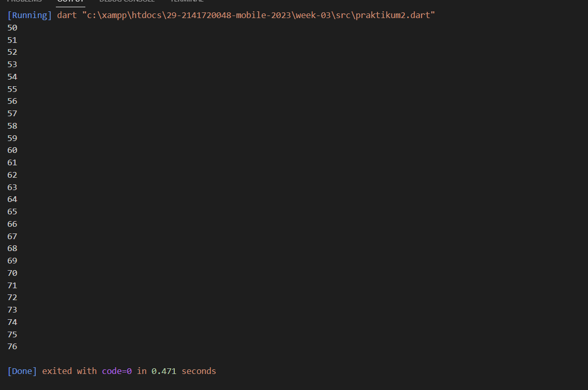

NIM : 2141720048

Nama : Shofiatul Ayu Anikaningrum

Absen : 29

Pertemuan 3

# PRAKTIKUM 1 - Menerapkan Control Flows("if/else")
# Langkah 1
Ketik atau salin kode program berikut ke dalam fungsi main().

# Langkah 2
Silakan coba eksekusi (Run) kode pada langkah 1 tersebut. Apa yang terjadi? Jelaskan!

Jawab : Output tersebut akan menghasilkan Test 2 dan Test2 again dikarenakan variable yang dipilih/ dideklarasikan dari awal yaitu test2 dan jika test==test2 maka akan mengeprint "Test2 again"

# Langkah 3
Tambahkan kode program berikut, lalu coba eksekusi (Run) kode Anda.

Apa yang terjadi ? Jika terjadi error, silakan perbaiki namun tetap menggunakan if/else.

# PRAKTIKUM 2 - Menerapkan Perulangan "while" dan "do-while"

# Langkah 1
Ketik atau salin kode program berikut ke dalam fungsi main().

# Langkah 2
Silakan coba eksekusi (Run) kode pada langkah 1 tersebut. Apa yang terjadi? Jelaskan! Lalu perbaiki jika terjadi error.

Jawab : Mengalami error karena tidak mendeklarasikan variabel dari "counter" terlebih dahulu serta menentukan berapa nilai awalnya.
Untuk memperbaiki kode tersebut tambahkan "var counter = 20"

# Langkah 3
Tambahkan kode program berikut, lalu coba eksekusi (Run) kode Anda.

Apa yang terjadi ? Jika terjadi error, silakan perbaiki namun tetap menggunakan do-while.

# PRAKTIKUM 3 - Menerapkan Perulangan "for" dan " break-continue"

# Langkah 1
Ketik atau salin kode program berikut ke dalam fungsi main().

# Langkah 2
Silakan coba eksekusi (Run) kode pada langkah 1 tersebut. Apa yang terjadi? Jelaskan! Lalu perbaiki jika terjadi error.

Jawab : Output yang dihasilkan akan menghasilkan error dikarenakan salah penulisan ,seharusnya int index = 10,serta tidak menambahkan index++ untuk melakukan perulangan.
Perbaikan : 

# Langkah 3
Tambahkan kode program berikut di dalam for-loop, lalu coba eksekusi (Run) kode Anda.

Apa yang terjadi ? Jika terjadi error, silakan perbaiki namun tetap menggunakan for dan break-continue.

Perbaikan :

# TUGAS PRAKTIKUM
Buatlah sebuah program yang dapat menampilkan bilangan prima dari angka 0 sampai 201 menggunakan Dart. Ketika bilangan prima ditemukan, maka tampilkan nama lengkap dan NIM Anda

Jawab :

# Percobaan Switch-Case

Switch-case digunakan untuk mengarahkan alur program berdasarkan nilai variabel a. Jika a adalah 1 atau 2, maka nilai a akan dicetak. Jika a adalah 3, nilai a + 1 akan dicetak. Jika a bukan 1, 2, atau 3, maka nilai a + 2 akan dicetak. Setiap kasus diakhiri dengan pernyataan break untuk menghindari eksekusi berlanjut ke kasus berikutnya.

