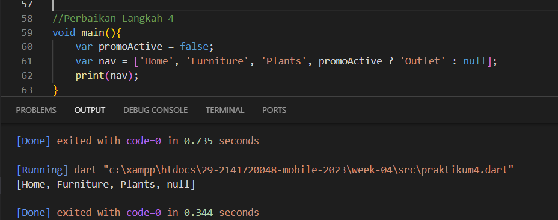
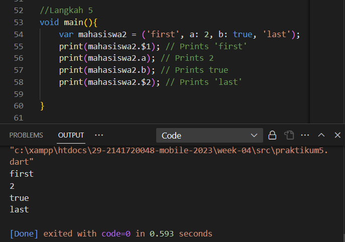
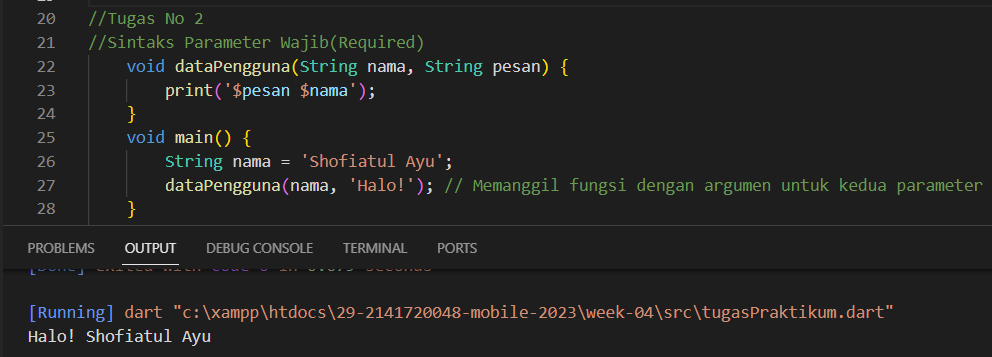
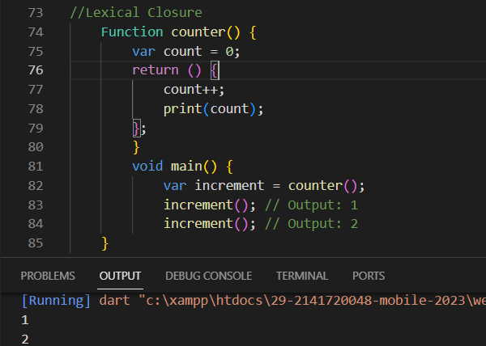

NIM : 2141720048

Nama : Shofiatul Ayu Anikaningrum

Absen : 29

Pertemuan 4

# PRAKTIKUM 1 - Eksperimen Tipe Data List
# Langkah 1 
Ketik atau salin kode program berikut ke dalam void main().

# Langkah 2
Silakan coba eksekusi (Run) kode pada langkah 1 tersebut. Apa yang terjadi? Jelaskan!

Jawab :

Pertama membuat list baru dengan nama list dengan beberapa isi, kemudian kedua mengecek apakah lengthnya 3, selanjutnya mengecek apakah list indeks ke 1 apakah 2 lalu mencetak length dan juga mencetak indeks ke 1 dari list. Kemudian merubah list indeks 1 menjadi 1, kemudian dicek apakah list indeks 1 adalah satu, kemudian diprint

# Langkah 3
Ubah kode pada langkah 1 menjadi variabel final yang mempunyai index = 5 dengan default value = null. Isilah nama dan NIM Anda pada elemen index ke-1 dan ke-2. Lalu print dan capture hasilnya.

Apa yang terjadi ? Jika terjadi error, silakan perbaiki.

# PRAKTIKUM 2 - Eksperimen Tipe Data Set
# Langkah 1
Ketik atau salin kode program berikut ke dalam fungsi main().

# Langkah 2
Silakan coba eksekusi (Run) kode pada langkah 1 tersebut. Apa yang terjadi? Jelaskan! Lalu perbaiki jika terjadi error.

Jawab :

Membuat dataset halogens dengan beberapa isi kemudian dicetak

# Langkah - 3
Tambahkan kode program berikut, lalu coba eksekusi (Run) kode Anda.

Apa yang terjadi ? Jika terjadi error, silakan perbaiki namun tetap menggunakan ketiga variabel tersebut. Tambahkan elemen nama dan NIM Anda pada kedua variabel Set tersebut dengan dua fungsi berbeda yaitu .add() dan .addAll(). Untuk variabel Map dihapus, nanti kita coba di praktikum selanjutnya.

Jawab : 

Terjadi error,karena pada setelah void main() tidak diberi kurung kurawal{}

Perbaikan :

# PRAKTIKUM 3 -  Eksperimen Tipe Data Maps
# Langkah 1
Ketik atau salin kode program berikut ke dalam fungsi main().

# Langkah 2
Silakan coba eksekusi (Run) kode pada langkah 1 tersebut. Apa yang terjadi? Jelaskan! Lalu perbaiki jika terjadi error.

Jawab :

Pada langkah tersebut membuat 2 variabel maps dengan beberapa isi key dan value yang kemudian diprint

# Langkah 3
Tambahkan kode program berikut, lalu coba eksekusi (Run) kode Anda.

Perbaikan :

# PRAKTIKUM 4 - Eksperimen Tipe Data List: Spread dan Control-flow Operators
# Langkah 1
Ketik atau salin kode program berikut ke dalam fungsi main().

# Langkah 2
Silakan coba eksekusi (Run) kode pada langkah 1 tersebut. Apa yang terjadi? Jelaskan! Lalu perbaiki jika terjadi error.

Jawab : 

Terjadi error karena salah pemanggilan nama variabel,seharusnya yang dipanggil "list1",pada kode program tersebut hanya memanggil "list" saja.

Perbaikan :

# Langkah 3
Tambahkan kode program berikut, lalu coba eksekusi (Run) kode Anda.

Jawab : 

Terjadi error karena tidak mendeklarasikan tipe data untuk list1. Seharusnya deklarasikan tipe datanya sebagai List<int?>. Dan  tidak mendeklarasikan atau menginisialisasi list1 terlebih dahulu. 

Perbaikan :

# Langkah 4
Tambahkan kode program berikut, lalu coba eksekusi (Run) kode Anda.

Apa yang terjadi ? Jika terjadi error, silakan perbaiki. Tunjukkan hasilnya jika variabel promoActive ketika true dan false.

Jawab : Terjadi error

Ketika True

Ketika false 

# Langkah 5
Tambahkan kode program berikut, lalu coba eksekusi (Run) kode Anda.

Apa yang terjadi ? Jika terjadi error, silakan perbaiki. Tunjukkan hasilnya jika variabel login mempunyai kondisi lain.

Jawab : 

Error disebabkan oleh penggunaan sintaksis yang salah dalam blok if dalam daftar nav2.

Perbaikan :

Mendefinisikan variabel login dengan nilai 'Manager'.Menggunakan operator == untuk memeriksa apakah login sama dengan 'Manager'. Jika benar, maka 'Inventory' akan ditambahkan ke dalam daftar nav2. Jika tidak, daftar nav2 akan tetap sama.

# Langkah 6
Tambahkan kode program berikut, lalu coba eksekusi (Run) kode Anda.

Apa yang terjadi ? Jika terjadi error, silakan perbaiki. Jelaskan manfaat Collection For dan dokumentasikan hasilnya.

Jawab : 

Yang terjadi adalah setiap indeks dari listOfInts dirubah menjadi string dan ditambahkan # sebelum angkanya.

Pada kode diatas, Collection for digunakan untuk membuat listOfStrings yang berisi elemen-elemen yang dihasilkan dari pemetaan listOfInts. Hasilnya adalah listOfStrings yang berisi string yang diawali dengan karakter '#' yang mengikuti nilai-nilai dalam listOfInts.
Dengan Collection for, dapat menghasilkan koleksi baru berdasarkan koleksi yang sudah ada dengan cara yang lebih mudah dan efisien, sehingga memudahkan transformasi dan manipulasi data dalam kode.

# PRAKTIKUM 5 - Eksperimen Tipe Data Records
# Langkah 1
Ketik atau salin kode program berikut ke dalam fungsi main().

# Langkah 2
Silakan coba eksekusi (Run) kode pada langkah 1 tersebut. Apa yang terjadi? Jelaskan! Lalu perbaiki jika terjadi error.

Jawab :

Terjadi error karena tidak terdapat titik koma diakhir.

Perbaikan :

# Langkah 3
Tambahkan kode program berikut di luar scope void main(), lalu coba eksekusi (Run) kode Anda.

Apa yang terjadi ? Jika terjadi error, silakan perbaiki. Gunakan fungsi tukar() di dalam main() sehingga tampak jelas proses pertukaran value field di dalam Records.

Jawab :

Tidak terjadi error,hanya saja tidak keluar output karena tidak dipanggil di dalam fungsi main

Perbaikan :

# Langkah 4
Tambahkan kode program berikut di dalam scope void main(), lalu coba eksekusi (Run) kode Anda.

Apa yang terjadi ? Jika terjadi error, silakan perbaiki. Inisialisasi field nama dan NIM Anda pada variabel record mahasiswa di atas. Dokumentasikan hasilnya dan buat laporannya!

Jawab :

Terjadi error karena itu hanya variable record tanpa isi.

Perbaikan :

# Langkah 5
Tambahkan kode program berikut di dalam scope void main(), lalu coba eksekusi (Run) kode Anda.

Apa yang terjadi ? Jika terjadi error, silakan perbaiki. Gantilah salah satu isi record dengan nama dan NIM Anda, lalu dokumentasikan hasilnya dan buat laporannya!

Jawab :

Pada record indeks pertama berupa string menggunakan $1 kemudian dirubah dengan membuat variable baru yaitu first kemudian diinstansiasi untuk isi first kemudian semua element record dicetak

# TUGAS PRAKTIKUM
1. Silakan selesaikan Praktikum 1 sampai 5, lalu dokumentasikan berupa screenshot hasil pekerjaan Anda beserta penjelasannya!

    Jawab :

    Sudah dijelaskan pada praktikum diatas.

2. Jelaskan yang dimaksud Functions dalam bahasa Dart!

    Jawab :

    Dalam bahasa Dart, "functions" (fungsi) adalah blok kode yang memiliki nama, tipe kembalian (jika ada), dan parameter (jika ada). Function tersebut digunakan untuk mengeksekusi tugas tertentu dalam program. Fungsi dapat menerima argumen, memiliki tipe kembalian, dan digunakan untuk mengorganisasi logika program menjadi unit-unit terpisah.

3. Jelaskan jenis-jenis parameter di Functions beserta contoh sintaksnya!

    Jawab :

    Terdapat 3 jenis parameter di dalam fungsi dart :

    1. Required Parameters (Parameter Wajib)

        Merupakan parameter yang harus tersedia ada ketika memanggil fungsi dan didefinisikan tanpa tanda tanya.Jenis parameter ini memastikan bahwa argumen harus diberikan saat memanggil fungsi.Dart tidak memiliki sintaksis bawaan untuk parameter wajib dinamis, tetapi Anda dapat mencapainya dengan menghilangkan nilai default pada parameter opsional dinamis.

        Contoh :

        

    2. Optional Parameters (Parameter Opsional)

        Jenis parameter ini memungkinkan Anda untuk mengabaikan beberapa argumen saat memanggil fungsi dengan memberikan nilai default untuk parameter-parameter tersebut. Parameter ini tidak wajib disediakan. Anda dapat memberikan nilai default untuk mereka. Mereka didefinisikan dengan tanda kurung kurawal `{}`.

        Contoh :

         

    3. Positional Parameters (Parameter Posisional)

        Jenis parameter ini adalah parameter yang diteruskan ke fungsi berdasarkan posisinya dalam daftar parameter. parameter yang bersifat opsional dan tidak memiliki nama, hanya posisinya yang penting. Mereka didefinisikan dengan tanda kurung siku `[]`.

        Contoh :

         

        

4. Jelaskan maksud Functions sebagai first-class objects beserta contoh sintaknya!

    Jawab :

    Fungsi sebagai "first-class objects" dalam Dart berarti fungsi dapat dianggap sebagai nilai yang dapat disimpan dalam variabel, dikirim sebagai argumen ke fungsi lain, atau dikembalikan dari fungsi lain. Ini memungkinkan Anda untuk memperlakukan fungsi seperti data lainnya.

    Contoh sintaks fungsi sebagai first-class objects: 

    

5. Apa itu Anonymous Functions? Jelaskan dan berikan contohnya!

    Jawab : 

    Anonymous functions, atau disebut juga lambda functions atau function literals, adalah fungsi yang tidak memiliki nama. Mereka biasanya digunakan untuk menjalankan logika sederhana atau sebagai argumen untuk fungsi lain tanpa perlu mendefinisikan fungsi secara terpisah.

    Contoh Anonymous Functions dalam Dart:

    1. Fungsi Tanpa Parameter 

    
    

    2. Fungsi dengan Parameter 

     

    3. Fungsi sebagai Argumen 

     

6. Jelaskan perbedaan Lexical scope dan Lexical closures! Berikan contohnya!

    Jawab :

    Lexical Scope adalah aturan yang menentukan kapan dan di mana sebuah variabel dapat diakses dalam fungsi berdasarkan lokasi deklarasinya dalam kode.

    Lexical Closures adalah kemampuan fungsi untuk "mengingat" dan mengakses variabel dari lexical scope yang lebih tinggi, bahkan setelah fungsi tersebut telah selesai dieksekusi.

    Contoh Lexical Scope :

     

    Contoh Lexical Closure :

    

7. Jelaskan dengan contoh cara membuat return multiple value di Functions!

    Jawab :

    Kita dapat membuat return multiple values dalam fungsi dengan mengemas nilai-nilai tersebut ke dalam sebuah objek seperti `List`, `Map`, atau `Records` dan mengembalikan objek tersebut.

    Contoh dengan List :

    

    Dalam contoh di atas, fungsi `hitung` mengembalikan dua nilai dalam sebuah List, dan kita mengakses nilai-nilai tersebut dengan indeks.
    Kita juga dapat menggunakan struktur data lain seperti `Map` atau `Records` untuk mengembalikan multiple values sesuai dengan kebutuhan.

