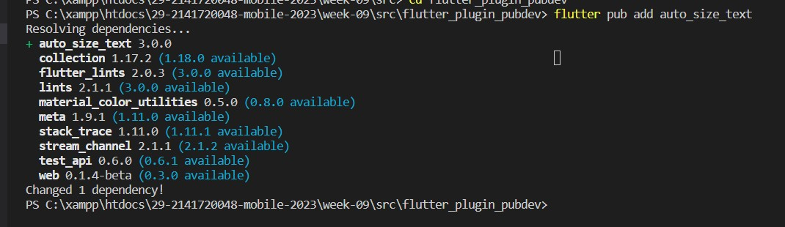

NIM : 2141720048

Nama : Shofiatul Ayu Anikaningrum

Absen : 29

# Pertemuan 9 - Manajemen Plugin

####  Langkah 1: Buat Project Baru

Buatlah sebuah project flutter baru dengan nama flutter_plugin_pubdev. Lalu jadikan repository di GitHub Anda dengan nama flutter_plugin_pubdev.

#### Langkah 2: Menambahkan Plugin

Tambahkan plugin auto_size_text menggunakan perintah berikut di terminal

#### Langkah 3: Buat file red_text_widget.dart

Buat file baru bernama red_text_widget.dart di dalam folder lib lalu isi kode seperti berikut.

#### Langkah 4: Tambah Widget AutoSizeText

Masih di file red_text_widget.dart, untuk menggunakan plugin auto_size_text, ubahlah kode return Container() menjadi seperti berikut.

#### Langkah 5: Buat Variabel text dan parameter di constructor

Tambahkan variabel text dan parameter di constructor seperti berikut.

#### Langkah 6: Tambahkan widget di main.dart

Buka file main.dart lalu tambahkan di dalam children: pada class _MyHomePageState

Run aplikasi tersebut dengan tekan F5, maka hasilnya akan seperti berikut.

## TUGAS PRAKTIKUM

1. Selesaikan Praktikum tersebut, lalu dokumentasikan dan push ke repository Anda berupa screenshot hasil pekerjaan beserta penjelasannya di file README.md!

2. Jelaskan maksud dari langkah 2 pada praktikum tersebut!

    Jawab :

    Pada langkah 2 menambahkan plugin auto_size_text ke dalam project yang digunakan untuk mengubah ukuran teks yang berada didalamnya sehingga sesuai dengan batasannya.

3. Jelaskan maksud dari langkah 5 pada praktikum tersebut!

    Jawab : 

    Pada langkah 5 tersebut menambahkan variabel bernama "text" bertipe data string dan memiliki kata kunci final yang artinya tidak dapat diubah, setelah widget dibuat untuk menyimpan teks yang akan ditampilkan oleh widget "RedTextWidget." Selain itu, juga menambahkan parameter "text" ke constructor widget ini, yang harus diisi saat membuat instance widget ini. Ini memungkinkan pengguna widget "RedTextWidget" untuk menentukan teks yang akan ditampilkan oleh widget tersebut saat menggunakannya.

4. Pada langkah 6 terdapat dua widget yang ditambahkan, jelaskan fungsi dan perbedaannya!

    Jawab :
    - RedTextWidget: Container digunakan untuk mengatur tampilan dan layout dari widget di dalamnya. Dalam contoh ini, Container memiliki latar belakang warna kuning (Colors.yellowAccent) dan lebar sebesar 50. Child: Di dalam Container ini, terdapat widget "RedTextWidget" yang Anda definisikan sebelumnya. "RedTextWidget" memiliki teks tetap ("You have pushed the button this many times:") yang akan ditampilkan dengan warna merah.

    - Widget Text: Seperti yang lain, Container digunakan untuk mengatur tampilan dan layout. Dalam contoh ini, Container memiliki latar belakang warna hijau (Colors.greenAccent) dan lebar sebesar 100. Child: Di dalam Container ini, terdapat widget bawaan Flutter yaitu "Text," yang juga memiliki teks tetap ("You have pushed the button this many times:").
    

5. Jelaskan maksud dari tiap parameter yang ada di dalam plugin auto_size_text berdasarkan tautan pada dokumentasi ini !

| Parameter             | Keterangan                                                                                                |         
|-----------------------|-----------------------------------------------------------------------------------------------------------|
| Key*                  | mengidentifikasi widget dalam sebuah widget lainnya pada tree flutter        |
| Style*                | Menentukan gaya teks, seperti ukuran font, warna, dll.        |  
| MinFontSize           | Ukuran font minimum yang akan digunakan untuk penyesuaian otomatis ukuran teks  | 
| MaxFontSize           | Ukuran font maksimum yang akan digunakan untuk penyesuaian otomatis ukuran teks  | 
| StepGranularity       | Penyesuaikan ukuran teks agar muat di batasan | 
| PresetFontsizes       | digunakan dalam penggunaan ukuran teks  dengan menggunakan ukuran font bawaan   | 
| Group                 | mengelompokkan beberapa widget AutoSizeText untuk menyesuaikan ukuran teks  | 
| TextAlign             | Menentukan perataan teks seperti 'left', 'center', 'right',   secara horizontal    |
| TextDirection*        | Menentukan arah teks seperti 'TextAlign.start' (kiri ke kanan) atau 'TextAlign.end' (kanan ke kiri)         |
| Locale*               | Pemilihan  bahasa atau lokasi untuk penulisan teks        |  
| SoftWrap*             | Menentukan apakah teks akan dilipat ke baris berikutnya jika tidak cukup ruang | 
| WrapWords             | Menentukan apakah teks akan dibungkus ke baris berikutnya jika tidak cukup ruang       | 
| Overflow*             | Jika tidak cukup ruang, misalnya 'ellipsis' maka akan  menampilkan titik-titik jika teks terpotong  | 
OverflowReplacement     | Widget alternatif yang akan ditampilkan sebagai pengganti teks yang terpotong  dan tidak muat dalam batasan   | 
| TextScaleFactor*      | Widget alternatif yang akan ditampilkan sebagai pengganti teks yang terpotong         | 
| MaxLines              | Jumlah maksimum baris teks yang akan ditampilkan       |
| SemanticsLabel*       | Untuk aksesibilitas atau pembaca layar         |

