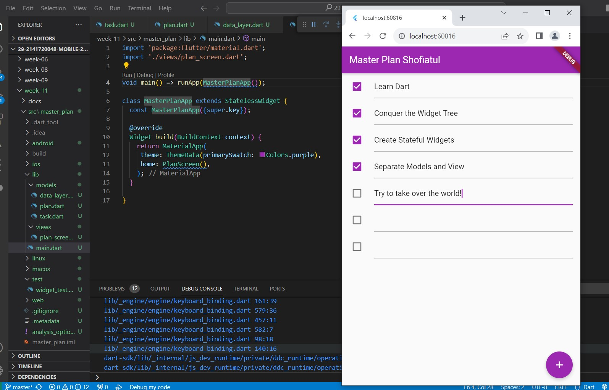
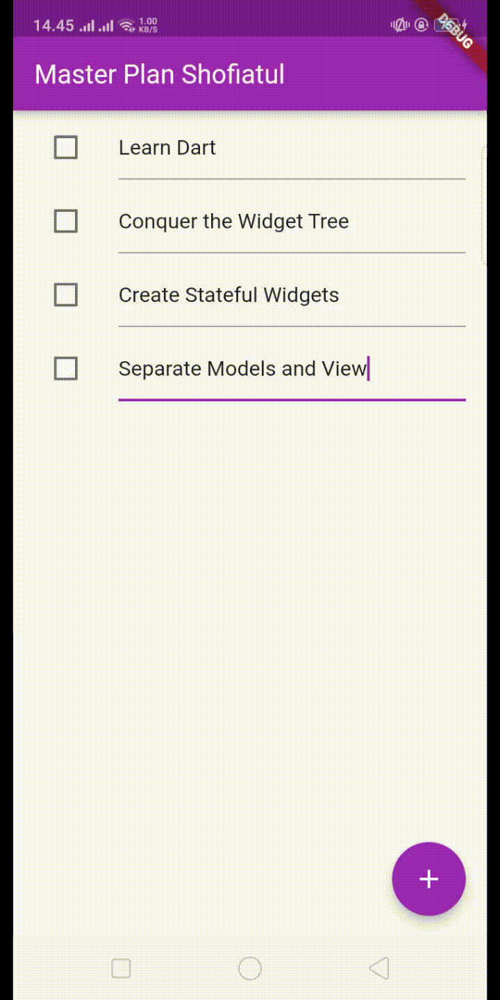

NIM : 2141720048

Nama : Shofiatul Ayu Anikaningrum

Absen : 29

# Pertemuan 11 - Dasar State Management

### Tugas Praktikum 1: Dasar State dengan Model-View

1. Selesaikan langkah-langkah praktikum tersebut, lalu dokumentasikan berupa GIF hasil akhir praktikum beserta penjelasannya di file README.md!

- Hasil run :

    

- Hasil run pada HP

    

2. Jelaskan maksud dari langkah 4 pada praktikum tersebut! Mengapa dilakukan demikian?

    Jawab : 

    Pada langkah tersebut, kita membuat file data_layer data layer yang digunakan untuk mempersingkat import data layer sehingga model-model tersebut akan bisa langsung diakses dengan mudah tanpa harus mengimport setiap model dengan terpisah.

3. Mengapa perlu variabel plan di langkah 6 pada praktikum tersebut? Mengapa dibuat konstanta ?

    Jawab :

    Variabel plan pada langkah 6 digunakan untuk menginisialisasi objek "Plan" yang diperlukan dalam PlanScreen. Dalam kode ini, "const Plan()"  tersebut digunakan untuk membuat objek Plan yang konstan. Penggunaan const mengindikasikan bahwa objek tersebut akan tetap konstan dan tidak akan berubah setelah inisialisasi.

4. Lakukan capture hasil dari Langkah 9 berupa GIF, kemudian jelaskan apa yang telah Anda buat!

    Jawab : 

    Pada langkah tersebut , membuat  widget _buildTaskTile untuk membuat tampilan item. Widget ini menggunakan ListTile yang berisi Checkbox untuk checlist status kelengkapan dan TextFormField untuk mengisi deskripsi. Saat ada perubahan pada status atau deskripsi tugas, data dapat diperbarui melalui fungsi onChanged dan setState.

5. Apa kegunaan method pada Langkah 11 dan 13 dalam lifecyle state ?

    Jawab :

    - Langkah 11

        Pada Langkah 11 menginisialisasi "scrollController" dan menambahkan _event listener_ pada scrollController untuk mengelola _keyboard focus_ saat _scroll_. Pada langkah ini bertujuan untuk mengatasi masalah _keyboard focus_ saat _scroll_.

    - Langkah 13

        Pada Langkah 13, method dispose digunakan untuk membersihkan sumber daya yang digunakan oleh widget PlanScreen saat widget tersebut dihapus atau tidak lagi diperlukan.
     

### Tugas Praktikum 2: InheritedWidget

1. Selesaikan langkah-langkah praktikum tersebut, lalu dokumentasikan berupa GIF hasil akhir praktikum beserta penjelasannya di file README.md!

2. Jelaskan mana yang dimaksud InheritedWidget pada langkah 1 tersebut! Mengapa yang digunakan InheritedNotifier?

3. Jelaskan maksud dari method di langkah 3 pada praktikum tersebut! Mengapa dilakukan demikian?

4. Lakukan capture hasil dari Langkah 9 berupa GIF, kemudian jelaskan apa yang telah Anda buat!

### Tugas Praktikum 3: State di Multiple Screens

1. Selesaikan langkah-langkah praktikum tersebut, lalu dokumentasikan berupa GIF hasil akhir praktikum beserta penjelasannya di file README.md!

2. Berdasarkan Praktikum 3 yang telah Anda lakukan, jelaskan maksud dari gambar diagram berikut ini!

