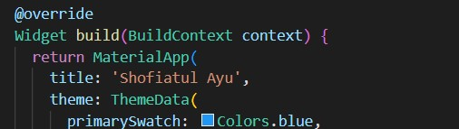
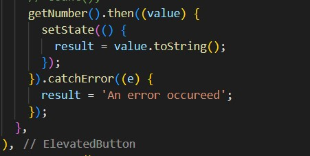
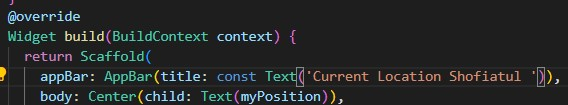
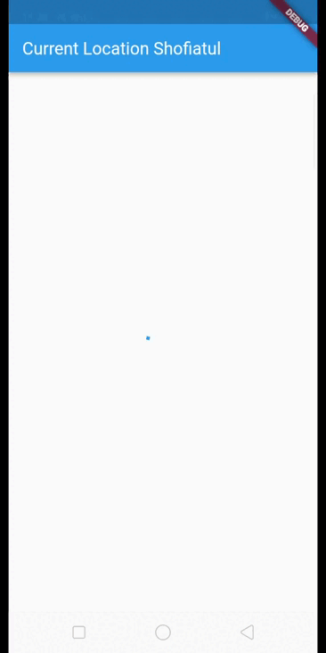

NIM    : 2141720048

Nama   : Shofiatul Ayu Anikaningrum

Absen  : 29

# Pertemuan 12 - Pemrograman Asynchronous

# Praktikum 1: Mengunduh Data dari Web Service (API)

#### Langkah 1: Buat Project Baru

#### Langkah 2: Cek file pubspec.yaml

  

#### Langkah 3: Buka file main.dart

  

#### Soal 1

- Tambahkan nama panggilan Anda pada title app sebagai identitas hasil pekerjaan Anda.

  

#### Langkah 4: Tambah method getData()

   

#### Soal 2

- Carilah judul buku favorit Anda di Google Books, lalu ganti ID buku pada variabel path di kode tersebut. Caranya ambil di URL browser Anda seperti gambar berikut ini.

- Kemudian cobalah akses di browser URI tersebut dengan lengkap seperti ini. Jika menampilkan data JSON, maka Anda telah berhasil. Lakukan capture milik Anda dan tulis di README pada laporan praktikum. Lalu lakukan commit dengan pesan "W12: Soal 2".

    

#### Soal 3

- Jelaskan maksud kode langkah 5 tersebut terkait substring dan catchError!

    Jawab : 

    substring:

    - Menggunakan substring(0, 450) untuk mengambil 0 hingga 449 karakter pertama dari string.

    catchError:

    - Menggunakan catchError untuk menangkap kesalahan yang mungkin terjadi selama operasi asynchronous.
    Jika terjadi kesalahan, result diatur sebagai 'An error occurred', dan setState dipanggil untuk memperbarui tampilan.

- Capture hasil praktikum Anda berupa GIF dan lampirkan di README. Lalu lakukan commit dengan pesan "W12: Soal 3".

  

# Praktikum 2: Menggunakan await/async untuk menghindari callbacks

#### Langkah 1: Buka file main.dart

Tambahkan tiga method berisi kode seperti berikut di dalam class _FuturePageState.

#### Langkah 2: Tambah method count()

#### Langkah 3: Panggil count()

#### Soal 4

- Jelaskan maksud kode langkah 1 dan 2 tersebut!

  Jawab :

  - Langkah 1 
  
    Menggunakan tiga fungsi asinkron (returnOneAsync, returnTwoAsync, dan returnThreeAsync),masing-masing mengembalikan nilai setelah penundaan 3 detik. Penggunaan 'async' dan 'await` memungkinkan eksekusi secara asinkron tanpa menghambat program utama.

  - Langkah 2 

    Menggunakan fungsi asinkron 'count', yang mengumpulkan hasil panggilan tiga fungsi asinkron sebelum mengupdate state (result). Penggunaan 'await' memastikan urutan eksekusi, dan 'setState` memastikan pembaruan tampilan setelah eksekusi selesai.

- Capture hasil praktikum Anda berupa GIF dan lampirkan di README. Lalu lakukan commit dengan pesan "W12: Soal 4".

  
  

# 5. Praktikum 3: Menggunakan Completer di Future

#### Langkah 1: Buka main.dart

Pastikan telah impor package async berikut.

    import 'package:async/async.dart';

#### Langkah 2: Tambahkan variabel dan method

Tambahkan variabel late dan method di class _FuturePageState seperti ini.

  

#### Langkah 3: Ganti isi kode onPressed()

#### Soal 5

- Jelaskan maksud kode langkah 2 tersebut!

  Jawab :

  Pada langkah tersebut menggunakan objek 'Completer' untuk menangani operasi asinkron. Dalam fungsi 'getNumber', objek Completer diinisialisasi dan dipasangkan dengan fungsi 'calculate()'. Fungsi calculate adalah fungsi asinkron yang menunda eksekusi selama 5 detik sebelum mengisi nilai 42 ke dalam 'completer'. Fungsi 'getNumber' mengembalikan objek 'Future' dari completer, memungkinkan akses ke nilai hasil operasi asinkron di waktu selanjutnya.

- Capture hasil praktikum Anda berupa GIF dan lampirkan di README. Lalu lakukan commit dengan pesan "W12: Soal 5".

  

#### Langkah 5: Ganti method calculate()

  

#### Langkah 6: Pindah ke onPressed()

  

#### Soal 6

- Jelaskan maksud perbedaan kode langkah 2 dengan langkah 5-6 tersebut!

  Jawab : 

  - Versi yang menggunakan try-catch memberikan lapisan perlindungan terhadap kemungkinan kesalahan selama penundaan.

  - Sementara itu, versi yang tanpa try-catch lebih sederhana dan tidak secara eksplisit menangani potensi kesalahan.

- Capture hasil praktikum Anda berupa GIF dan lampirkan di README. Lalu lakukan commit dengan pesan "W12: Soal 6".

  

# Praktikum 4: Memanggil Future secara paralel

#### Langkah 1: Buka file main.dart

Tambahkan method ini ke dalam class _FuturePageState

  

#### Langkah 2: Edit onPressed()

  

#### Soal 7

- Capture hasil praktikum Anda berupa GIF dan lampirkan di README. Lalu lakukan commit dengan pesan "W12: Soal 7".

  

#### Langkah 4: Ganti variabel futureGroup

#### Soal 8

Jelaskan maksud perbedaan kode langkah 1 dan 4!

  Jawab : 

  Perbedaannya terletak pada pendekatan penanganan dan penungguan kelompok Future. Langkah 1 menggunakan objek FutureGroup, sementara Langkah 4 secara langsung menerapkan Future.wait untuk mengatasi beberapa Future secara bersamaan. 

# Praktikum 5: Menangani Respon Error pada Async Code

#### Langkah 1: Buka file main.dart

Tambahkan method ini ke dalam class _FuturePageState

  

#### Langkah 2: ElevatedButton

  

#### Soal 9

- Capture hasil praktikum Anda berupa GIF dan lampirkan di README. Lalu lakukan commit dengan pesan "W12: Soal 9".

  

#### Langkah 4: Tambah method handleError()

#### Soal 10

- Panggil method handleError() tersebut di ElevatedButton, lalu run. Apa hasilnya? Jelaskan perbedaan kode langkah 1 dan 4!

  

  Jawab :
  - Langkah 1
  Fungsi returnError melempar error tanpa menangkapnya secara langsung dan tidak ada upaya untuk menangani atau merespons error di dalam fungsi tersebut.

  - Langkah 4

    Fungsi handleError memanggil fungsi returnError dalam blok try.
    Jika terjadi error selama eksekusi returnError, blok catch menangkap error dan melakukan penanganan error dengan mengubah nilai result dengan pesan error.
    
  

# Praktikum 6: Menggunakan Future dengan StatefulWidget

#### Langkah 1: install plugin geolocator

  

#### Langkah 2: Tambah permission GPS

Jika Anda menargetkan untuk platform Android, maka tambahkan baris kode berikut di file android/app/src/main/androidmanifest.xml

  

#### Langkah 3: Buat file geolocation.dart

  

#### Langkah 5: Isi kode geolocation.dart

      import 'package:flutter/material.dart';
      import 'package:geolocator/geolocator.dart';

      class LocationScreen extends StatefulWidget {
        const LocationScreen({super.key});

        @override
        State<LocationScreen> createState() => _LocationScreenState();
      }
      class _LocationScreenState extends State<LocationScreen> {
        String myPosition = '';
        @override
        void initState() {
          super.initState();
          getPosition().then((Position myPos) {
            myPosition =
                'Latitude: ${myPos.latitude.toString()} - Longitude: ${myPos.longitude.toString()}';
            setState(() {
              myPosition = myPosition;
            });
          });
        }
        @override
        Widget build(BuildContext context) {
          return Scaffold(
            appBar: AppBar(title: const Text('Current Location ')),
            body: Center(child: Text(myPosition)),
          );
        }
        Future<Position> getPosition() async {
          await Geolocator.requestPermission();
          await Geolocator.isLocationServiceEnabled();
          Position? position = await Geolocator.getCurrentPosition();
          return position;
        }
      }

#### Soal 11

- Tambahkan nama panggilan Anda pada tiap properti title sebagai identitas pekerjaan Anda.

  

#### Langkah 6: Edit main.dart

#### Langkah 7: Run

#### Langkah 8: Tambahkan animasi loading

  

#### Soal 12

- Jika Anda tidak melihat animasi loading tampil, kemungkinan itu berjalan sangat cepat. Tambahkan delay pada method getPosition() dengan kode await Future.delayed(const Duration(seconds: 3));

   

- Apakah Anda mendapatkan koordinat GPS ketika run di browser? Mengapa demikian?

  Jawab : 

  Jika dijalankan di browser, Flutter web masih dapat mengakses atau mendapatkan koordinat GPS karena menggunakan API Geolocation dari browser langsung. Dalam konteks Flutter web, izin akses lokasi dikelola oleh browser, tidak oleh sistem operasi (misalnya, Android pada perangkat seluler). Meskipun tidak perlu menambahkan izin secara langsung ke AndroidManifest, koordinat GPS masih dapat diakses di browser, tetapi tetap memerlukan izin dari pengguna.

    

  

- Capture hasil praktikum Anda berupa GIF dan lampirkan di README. Lalu lakukan commit dengan pesan "W12: Soal 12".

# Praktikum 7: Manajemen Future dengan FutureBuilder

#### Langkah 1: Modifikasi method getPosition()

  

#### Langkah 2: Tambah variabel

Tambah variabel ini di class _LocationScreenState

  

#### Langkah 3: Tambah initState()

  

#### Langkah 4: Edit method build()

  

#### Soal 13

- Apakah ada perbedaan UI dengan praktikum sebelumnya? Mengapa demikian?

  Jawab : 

  Kedua praktikum tersebut tidak memiliki perbedaan pada antarmuka pengguna (UI). Keduanya menampilkan koordinat geolokasi dengan tata letak yang identik. Kesamaan ini disebabkan oleh pengambilan lokasi yang masih bersifat sinkron di dalam blok initState pada kedua praktikum. Waktu tampilan UI pada keduanya juga mengalami delay yang sama, yaitu 3 detik. Selain itu, tampilan UI dapat tampak seragam karena FutureBuilder secara otomatis mengelola pembaruan UI, bahkan tanpa perlu pemanggilan setState secara langsung.

- Capture hasil praktikum Anda berupa GIF dan lampirkan di README. Lalu lakukan commit dengan pesan "W12: Soal 13".

  

- Seperti yang Anda lihat, menggunakan FutureBuilder lebih efisien, clean, dan reactive dengan Future bersama UI.

#### Langkah 5: Tambah handling error

  

#### Soal 14

- Apakah ada perbedaan UI dengan langkah sebelumnya? Mengapa demikian?

  Jawab : 

  Tidak ada perbedaan,  hanya  saja menambahakn kode program errorhandling, yang jika terjadi kesalahan dan akan menampilkan teks kesalahan. Tetapi pada pada praktikum ini tidak terjadi error

- Capture hasil praktikum Anda berupa GIF dan lampirkan di README. Lalu lakukan commit dengan pesan "W12: Soal 14".

  

# Praktikum 8: Navigation route dengan Future Function

#### Soal 15

- Tambahkan nama panggilan Anda pada tiap properti title sebagai identitas pekerjaan Anda.

- Silakan ganti dengan 
warna tema favorit Anda.

#### Soal 16

- Cobalah klik setiap button, apa yang terjadi ? Mengapa demikian ?

- Gantilah 3 warna pada langkah 5 dengan warna favorit Anda!

- Capture hasil praktikum Anda berupa GIF dan lampirkan di README. Lalu lakukan commit dengan pesan "W12: Soal 16".

# 11. Praktikum 9: Memanfaatkan async/await dengan Widget Dialog

#### Soal 17

- Cobalah klik setiap button, apa yang terjadi ? Mengapa demikian ?

- Gantilah 3 warna pada langkah 3 dengan warna favorit Anda!

- Capture hasil praktikum Anda berupa GIF dan lampirkan di README. Lalu lakukan commit dengan pesan "W12: Soal 17".