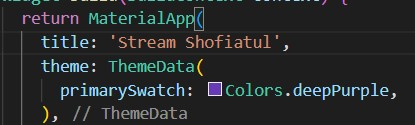
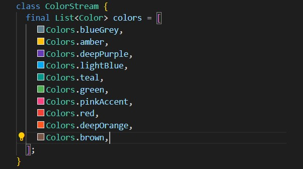
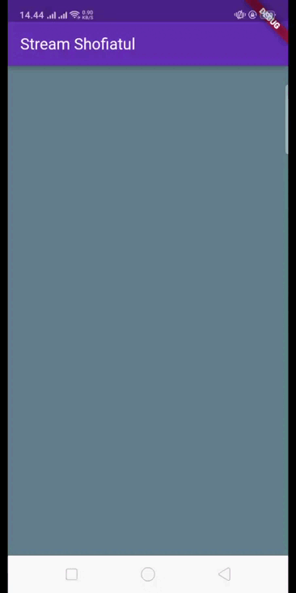

NIM    : 2141720048

Nama   : Shofiatul Ayu Anikaningrum

Absen  : 29

# Pertemuan 13 - Lanjutan State Management dengan Streams

# Praktikum 1: Dart Streams

#### Soal 1
- Tambahkan nama panggilan Anda pada title app sebagai identitas hasil pekerjaan Anda.

    

- Gantilah warna tema aplikasi sesuai kesukaan Anda.
- Lakukan commit hasil jawaban Soal 1 dengan pesan "W13: Jawaban Soal 1"

#### Soal 2
- Tambahkan 5 warna lainnya sesuai keinginan Anda pada variabel colors tersebut.

    

- Lakukan commit hasil jawaban Soal 2 dengan pesan "W13: Jawaban Soal 2"

#### Soal 3
- Jelaskan fungsi keyword yield* pada kode tersebut!

    Jawab : 

    Keyword 'yield*' pada kode tersebut menggabungkan nilai-nilai dari generator 'Stream.periodic ke dalam generator utama. Dengan demikian, stream utama menghasilkan nilai-nilai dari list colors secara periodik, menciptakan efek perubahan warna setiap detiknya dan melakukan perubahan warna yang teratur.

- Apa maksud isi perintah kode tersebut?

    Jawab : 

    - Stream.periodic digunakan untuk membuat stream periodik.
    - const Duration(seconds: 1) untuk menentukan interval detik.
    - (int t)merupakan fungsi yang dijalankan pada setiap periode dengan waktu t sebagai parameter.
    - int index = t % colors.length untuk menghitung indeks dengan modulus.
    - return colors[index] untuk mengembalikan nilai dari list colors.

- Lakukan commit hasil jawaban Soal 3 dengan pesan "W13: Jawaban Soal 3"

#### Soal 4
- Capture hasil praktikum Anda berupa GIF dan lampirkan di README.

    

- Lakukan commit hasil jawaban Soal 4 dengan pesan "W13: Jawaban Soal 4"

#### Soal 5
- Jelaskan perbedaan menggunakan listen dan await for (langkah 9) !

    Jawab : 
    Perbedaan antara menggunakan 'await for' dan 'listen' terletak pada pendekatan dan interaksi dengan stream. 
    - await for bersifat imperatif dan secara aktif menunggu serta mengonsumsi setiap nilai stream secara berurutan, sementara 
    - listen bersifat deklaratif, mendaftarkan callback untuk dijalankan setiap kali stream mengeluarkan nilai baru. 
    Dalam konteks kode yang diberikan, keduanya mencapai hasil yang sama yaitu pembaruan nilai 'bgColor'.

- Lakukan commit hasil jawaban Soal 5 dengan pesan "W13: Jawaban Soal 5"

# Praktikum 2: Stream controllers dan sinks

#### Soal 6
- Jelaskan maksud kode langkah 8 dan 10 tersebut!
- Capture hasil praktikum Anda berupa GIF dan lampirkan di README.
- Lalu lakukan commit dengan pesan "W13: Jawaban Soal 6".

#### Soal 7
- Jelaskan maksud kode langkah 13 sampai 15 tersebut!
- Kembalikan kode seperti semula pada Langkah 15, comment addError() agar Anda dapat melanjutkan ke praktikum 3 berikutnya.
- Lalu lakukan commit dengan pesan "W13: Jawaban Soal 7".

# Praktikum 3: Injeksi data ke streams

#### Soal 8
- Jelaskan maksud kode langkah 1-3 tersebut!
- Capture hasil praktikum Anda berupa GIF dan lampirkan di README.
- Lalu lakukan commit dengan pesan "W13: Jawaban Soal 8".

# Praktikum 4: Subscribe ke stream events

#### Soal 9
- Jelaskan maksud kode langkah 2, 6 dan 8 tersebut!
- Capture hasil praktikum Anda berupa GIF dan lampirkan di README.
- Lalu lakukan commit dengan pesan "W13: Jawaban Soal 9".

# Praktikum 5: Multiple stream subscriptions

#### Soal 10
Jelaskan mengapa error itu bisa terjadi ?

#### Soal 11
- Jelaskan mengapa hal itu bisa terjadi ?
- Capture hasil praktikum Anda berupa GIF dan lampirkan di README.
- Lalu lakukan commit dengan pesan "W13: Jawaban Soal 10,11".

# Praktikum 6: StreamBuilder

#### Soal 12
- Jelaskan maksud kode pada langkah 3 dan 7 !
- Capture hasil praktikum Anda berupa GIF dan lampirkan di README.
- Lalu lakukan commit dengan pesan "W13: Jawaban Soal 12".

# Praktikum 7: BLoC Pattern

#### Soal 13
- Jelaskan maksud praktikum ini ! Dimanakah letak konsep pola BLoC-nya ?
- Capture hasil praktikum Anda berupa GIF dan lampirkan di README.
- Lalu lakukan commit dengan pesan "W13: Jawaban Soal 13".