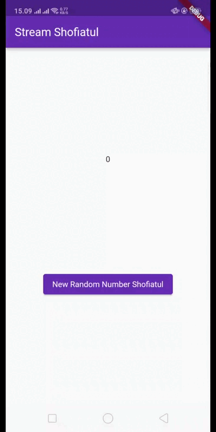
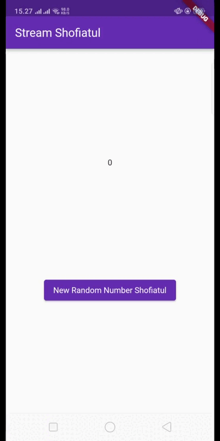
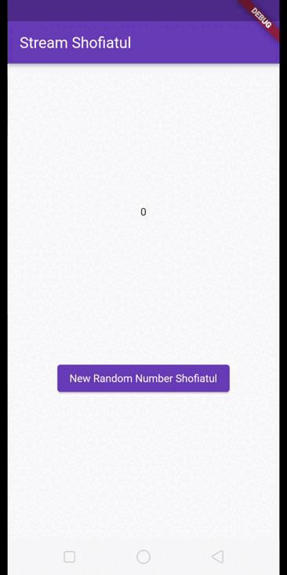
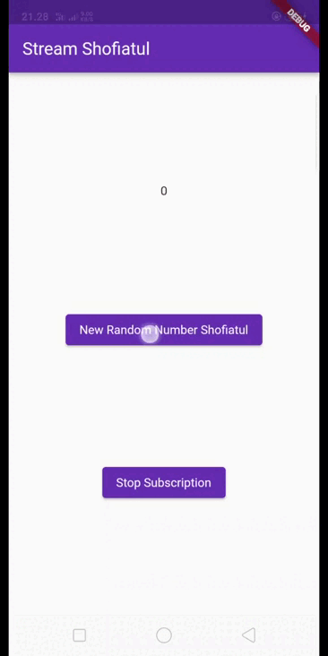
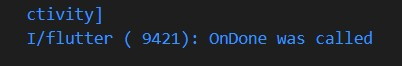

NIM    : 2141720048

Nama   : Shofiatul Ayu Anikaningrum

Absen  : 29

# Pertemuan 13 - Lanjutan State Management dengan Streams

# Praktikum 1: Dart Streams

#### Soal 1
- Tambahkan nama panggilan Anda pada title app sebagai identitas hasil pekerjaan Anda.

    

- Gantilah warna tema aplikasi sesuai kesukaan Anda.
- Lakukan commit hasil jawaban Soal 1 dengan pesan "W13: Jawaban Soal 1"

#### Soal 2
- Tambahkan 5 warna lainnya sesuai keinginan Anda pada variabel colors tersebut.

    

- Lakukan commit hasil jawaban Soal 2 dengan pesan "W13: Jawaban Soal 2"

#### Soal 3
- Jelaskan fungsi keyword yield* pada kode tersebut!

    Jawab : 

    Keyword 'yield*' pada kode tersebut menggabungkan nilai-nilai dari generator 'Stream.periodic ke dalam generator utama. Dengan demikian, stream utama menghasilkan nilai-nilai dari list colors secara periodik, menciptakan efek perubahan warna setiap detiknya dan melakukan perubahan warna yang teratur.

- Apa maksud isi perintah kode tersebut?

    Jawab : 

    - Stream.periodic digunakan untuk membuat stream periodik.
    - const Duration(seconds: 1) untuk menentukan interval detik.
    - (int t)merupakan fungsi yang dijalankan pada setiap periode dengan waktu t sebagai parameter.
    - int index = t % colors.length untuk menghitung indeks dengan modulus.
    - return colors[index] untuk mengembalikan nilai dari list colors.

- Lakukan commit hasil jawaban Soal 3 dengan pesan "W13: Jawaban Soal 3"

#### Soal 4
- Capture hasil praktikum Anda berupa GIF dan lampirkan di README.

    

- Lakukan commit hasil jawaban Soal 4 dengan pesan "W13: Jawaban Soal 4"

#### Soal 5
- Jelaskan perbedaan menggunakan listen dan await for (langkah 9) !

    Jawab : 
    Perbedaan antara menggunakan 'await for' dan 'listen' terletak pada pendekatan dan interaksi dengan stream. 
    - await for bersifat imperatif dan secara aktif menunggu serta mengonsumsi setiap nilai stream secara berurutan, sementara 
    - listen bersifat deklaratif, mendaftarkan callback untuk dijalankan setiap kali stream mengeluarkan nilai baru. 
    Dalam konteks kode yang diberikan, keduanya mencapai hasil yang sama yaitu pembaruan nilai 'bgColor'.

- Lakukan commit hasil jawaban Soal 5 dengan pesan "W13: Jawaban Soal 5"

# Praktikum 2: Stream controllers dan sinks

#### Soal 6
- Jelaskan maksud kode langkah 8 dan 10 tersebut!
    
    Jawab :
    - Langkah 8:

        Dalam initState, objek 'NumberStream' dan 'numberStreamController' diinisialisasi. Stream diambil dari 'numberStreamController.stream', dan setiap kali stream mengeluarkan nilai baru, callback dijalankan untuk mengupdate lastNumber dan memicu pembangunan ulang widget dengan setState.

    - Langkah 10:

        Pada method addRandomNumber dibuat untuk menambahkan angka acak ke dalam stream. Dalam metode ini, objek 'Random' digunakan untuk menghasilkan angka acak (myNum), yang kemudian ditambahkan ke dalam stream melalui 'numberStream.addNumberToSink'. Dan memicu pada langkah 8

- Capture hasil praktikum Anda berupa GIF dan lampirkan di README.

    

- Lalu lakukan commit dengan pesan "W13: Jawaban Soal 6".

#### Soal 7
- Jelaskan maksud kode langkah 13 sampai 15 tersebut!

    Jawab :

    - Langkah 13 menambahkan pesan error ke dalam stream dengan menggunakan metode 'addError'.

    - Langkah 14, dalam methode initState, mendengarkan stream dengan 'listen'. Setiap kali stream mengeluarkan nilai baru, callback dijalankan untuk memperbarui 'lastNumber' dan memicu pembangunan ulang widget. Blok 'onError' menangkap dan mengelola error dalam stream, mengatur lastNumber menjadi -1 jika error terjadi.

    - Langkah 15, melalui metode 'addRandomNumber', menambahkan error ke dalam stream dengan memanggil 'numberStream.addError()'. Error ini kemudian ditangkap oleh langkah sebelumnya (Langkah 14) untuk dikelola.

        

- Kembalikan kode seperti semula pada Langkah 15, comment addError() agar Anda dapat melanjutkan ke praktikum 3 berikutnya.

- Lalu lakukan commit dengan pesan "W13: Jawaban Soal 7".

# Praktikum 3: Injeksi data ke streams

#### Soal 8
- Jelaskan maksud kode langkah 1-3 tersebut!

    Jawab : 

    - Langkah 1

        Deklarasi variabel 'transformer sebagai variabel late untuk digunakan nanti.

    - Langkah 2

        Inisialisasi transformer sebagai objek 'StreamTransformer' yang mengubah data bertipe int menjadi int. Penanganan khusus ditentukan, termasuk perkalian nilai dengan 10 (handleData), penanganan error dengan mengirimkan error nilai -1 (handleError), dan penutupan sink saat stream selesai (handleDone).

    - Langkah 3

        Menggunakan 'transformer' untuk mengubah data dalam stream (stream.transform(transformer)) dan kemudian mendengarkan perubahan dalam stream. Jika ada data masuk, nilai dari data tersebut akan di-set sebagai 'lastNumber' dalam fungsi 'setState'. Jika terjadi error, nilai 'lastNumber' akan di-set sebagai -1 dalam fungsi setState.

- Capture hasil praktikum Anda berupa GIF dan lampirkan di README.

    

- Lalu lakukan commit dengan pesan "W13: Jawaban Soal 8".

# Praktikum 4: Subscribe ke stream events

#### Soal 9
- Jelaskan maksud kode langkah 2, 6 dan 8 tersebut!

    Jawab : 

    - Langkah 2 

        Dalam langkah ini, objek NumberStream dibuat untuk mengelola stream angka. numberStreamController digunakan untuk mengontrol stream, dan langganan (listen) dibuat untuk mengupdate nilai lastNumber setiap kali ada data masuk.
    
    - Langkah 6 

        numberStreamController.close() digunakan untuk menutup controller stream, menghentikan pengiriman data ke dalam stream. Selanjutnya, subscription.cancel() digunakan untuk membatalkan langganan (subscription) terhadap stream yang telah dibuat sebelumnya. Hal ini penting untuk memastikan bahwa tidak ada langganan yang tersisa yang dapat menyebabkan memory leak atau masalah sumber daya lainnya setelah widget atau halaman dihapus.

    - Langkah 8

        Fungsi addRandomNumber digunakan untuk menambahkan bilangan acak ke dalam stream. Sebelum menambahkan nilai, dilakukan pengecekan apakah controller stream sudah ditutup. Jika sudah, nilai lastNumber di-set sebagai -1.

- Capture hasil praktikum Anda berupa GIF dan lampirkan di README.

    

    Tekan button ‘Stop Subscription' : Anda akan melihat pesan di Debug Console seperti berikut.

    

- Lalu lakukan commit dengan pesan "W13: Jawaban Soal 9".

# Praktikum 5: Multiple stream subscriptions

#### Soal 10
Jelaskan mengapa error itu bisa terjadi ?

#### Soal 11
- Jelaskan mengapa hal itu bisa terjadi ?
- Capture hasil praktikum Anda berupa GIF dan lampirkan di README.
- Lalu lakukan commit dengan pesan "W13: Jawaban Soal 10,11".

# Praktikum 6: StreamBuilder

#### Soal 12
- Jelaskan maksud kode pada langkah 3 dan 7 !
- Capture hasil praktikum Anda berupa GIF dan lampirkan di README.
- Lalu lakukan commit dengan pesan "W13: Jawaban Soal 12".

# Praktikum 7: BLoC Pattern

#### Soal 13
- Jelaskan maksud praktikum ini ! Dimanakah letak konsep pola BLoC-nya ?
- Capture hasil praktikum Anda berupa GIF dan lampirkan di README.
- Lalu lakukan commit dengan pesan "W13: Jawaban Soal 13".